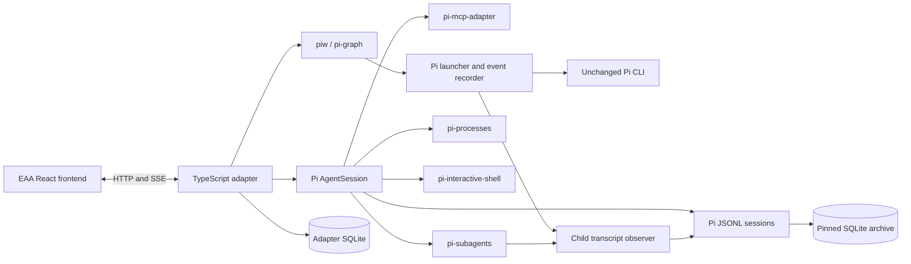

# Architecture and API reference

## Ownership

`pi-experiment-ops` is a separate package owning pinned upstream resources, workflow examples, and Python provisioning. This application obtains resource paths through its exported `resources()` function, replacing the policy, MCP, terminal, and archive entrypoints with browser bridges. Upstream APIs needed by those bridges are available through bundle exports. The dependency points from this application to the bundle; the bundle has no frontend or HTTP dependency. The WebUI imports Pi's unchanged SDK through `pi-experiment-ops/sdk`, and the child observer launcher uses the bundle's `piCli`. The bundle owns the single installed Pi dependency. Native provider configuration and session paths come from its `workspacePaths()` helper. See [repository separation](repositories.md).

Pi owns primary agent execution, messages, tool calls, provider transport, and session files. Pi-subagents owns child launch/steer/stop/lifecycle. Pi-processes owns process execution. Pi-interactive-shell owns PTYs. Pi-graph owns workflow scheduling, gates, cancellation, run ledgers, and resume. The adapter owns browser transport, resource controls, display projections, artifact registration, and completion deduplication.

The SDK host loads eight extension entry points: policy, MCP factory bridge, terminal registration bridge, upstream subagents, upstream processes, upstream modes, archive discovery bridge, and upstream graph. Bridges wrap extension registration or consume public events. Dependency files are unchanged.

The archive bridge scopes startup discovery to application sessions instead of the upstream extension's default home-directory scan. It retains the upstream search tool, schema, and turn indexer. Graph recordings are persisted with Pi's SessionManager and indexed through the pinned archive's exported indexer. A child session includes an `eaa-parent` custom entry; adapter metadata additionally maps it to the primary/workflow run.

Session replacement disposes the current runtime, emits shutdown, reloads resources, binds extension UI hooks, subscribes to the new session, and reapplies sequential tool execution. New/resume/branch share this path. The application intentionally has one active primary session per instance.

## Snapshot and events

`GET /api/state` returns `conversations`, `logs`, `status`, `input_requested`, `interrupt_requested`, `plan_mode`, `tool_execution_queue`, `message_queue`, `session_id`, `sequence`, and capability flags. A conversation contains an ID, label, kind, optional parent/status/terminal/approval, and messages. Tool schemas follow the EAA function-schema envelope.

`GET /api/events` uses Server-Sent Events. Every connection begins with `snapshot`, including reconnects with Last-Event-ID. Subsequent events carry a monotonically increasing SSE `id` within the primary session. The authoritative snapshot resets the browser's sequence when switching sessions. Messages have stable IDs derived from Pi's role/timestamp/tool-call identity and are replaced during streaming. Terminal updates carry a separate per-terminal sequence. Completed jobs are inserted once using a SQLite unique key.

Event types include `message.created`, `conversation.created`, `conversation.terminated`, `status.changed`, `queue.changed`, `terminal.output.appended`, `terminal.finished`, `approval.requested`, `interrupt.requested`, `interrupt.cleared`, and `log.created`. Images attached to Pi messages are displayed in the browser's image panel and gallery. Workflow files remain in the runner's output directory.

## HTTP API

POST bodies are JSON. Errors return `{ "error": "...", "message": "..." }`. HTTP 400 denotes invalid input, 404 unknown resources, 409 active-work/policy conflicts, 403 invalid origin/host, and 413 oversized bodies. The body limit is 12 MiB, including base64 image encoding. Successful creation/launch endpoints return 201, others 200.

| Method/path | Body or result |
|---|---|
| `GET /api/health` | Extension count and active session ID |
| `GET /api/state` | Authoritative UI snapshot |
| `GET /api/events` | Snapshot followed by live SSE |
| `POST /api/input` | `{content, images?: [registeredPath], plan_mode?: boolean}`; returns after scheduling |
| `POST /api/interrupt` | Abort primary work; independent jobs retain own controls |
| `POST /api/approval` | `{approval_id, approved: boolean}` |
| `POST /api/upload-image` | `{image_data: "data:image/png;base64,..."}` → `{file_path}` |
| `GET /api/image?path=...` | Registered image bytes |
| `GET /api/skill-catalog` | `{skills: [{name, description}]}` |
| `GET /api/tool-schemas` | `{tools: [{type, function, mcp?}]}` |
| `POST /api/mcp/reconnect` | `{server_id}`; requires idle |
| `POST /api/mode` | `{plan_mode: boolean}`; requires idle |
| `GET /api/sessions` | `{sessions, active}` |
| `POST /api/sessions` | `{action: "new"|"resume"|"branch", session_id?}`; requires idle |
| `GET /api/subagents` | Upstream status/fleet/asyncSnapshot DTO |
| `POST /api/subagents` | `{task, agent?: "reviewer"}` → upstream asynchronous launch result |
| `POST /api/subagents/:id/steer` | `{message}`; ID is the upstream async run ID |
| `POST /api/subagents/:id/stop` | Stop the owned async run |
| `POST /api/processes` | `{command}` → upstream process result |
| `POST /api/terminals` | `{command?: "bash --noprofile --norc"}` → upstream `details.sessionId` |
| `POST /api/terminals/:id/input` | `{input, submit?: true}` |
| `POST /api/jobs/:id/cancel` | URL-encoded `process:…`, `terminal:…`, `subagent:…`, or `workflow:…` ID |
| `GET /api/workflows` | Available workflow names and host workflow records for the active primary session |
| `POST /api/workflows/run` | `{input, workflow}` |
| `POST /api/workflows/resume` | `{id: hostRunId}` |

Plan mode denies mutating launch/steer/input endpoints as well as model tool calls. Session replacement rejects active work and lists it in the error. Primary prompt interruption, job cancellation, session history restoration, and workflow resume are distinct operations.

## Data and recovery contracts

Pi JSONL files remain authoritative for primary conversation histories. Adapter SQLite persists the UI snapshot, relationship metadata, workflow records, artifact references, and completed-job identities. The pinned archive indexes searchable transcript entries. Child event streams provide live display and durable Pi-format projections without changing the graph runner. Failed or stopped child assistant messages retain their native stop reasons in those Pi sessions.

The server's graceful shutdown closes HTTP streams and the extensions' owned resources. The CLI exits after those hooks because some upstream CLI-oriented modules retain idle timers; the test harness uses Node's `--test-force-exit` for the same reason after explicit cleanup. Transcript recovery does not imply process resurrection. This version supports graceful restart and interrupted-state recovery, not transparent migration of live OS processes between hosts.
